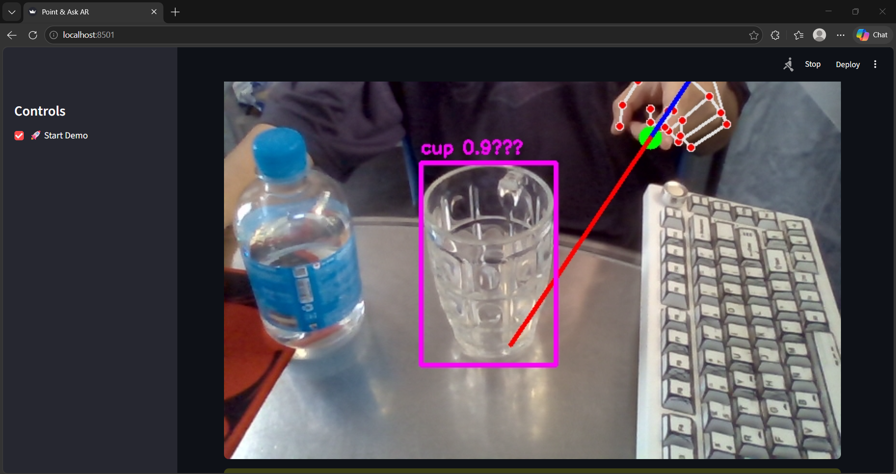
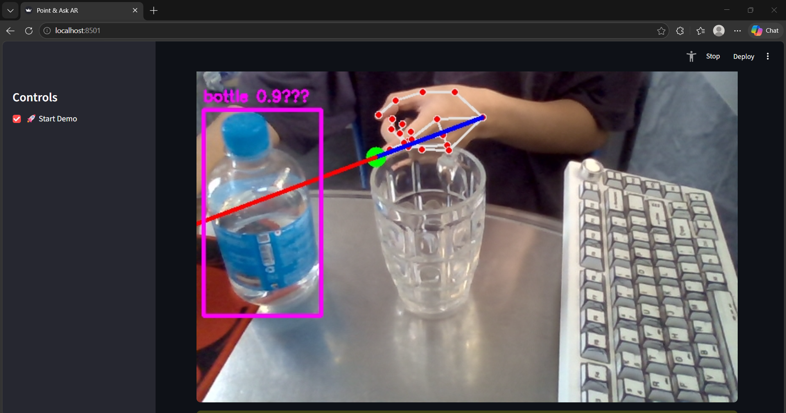
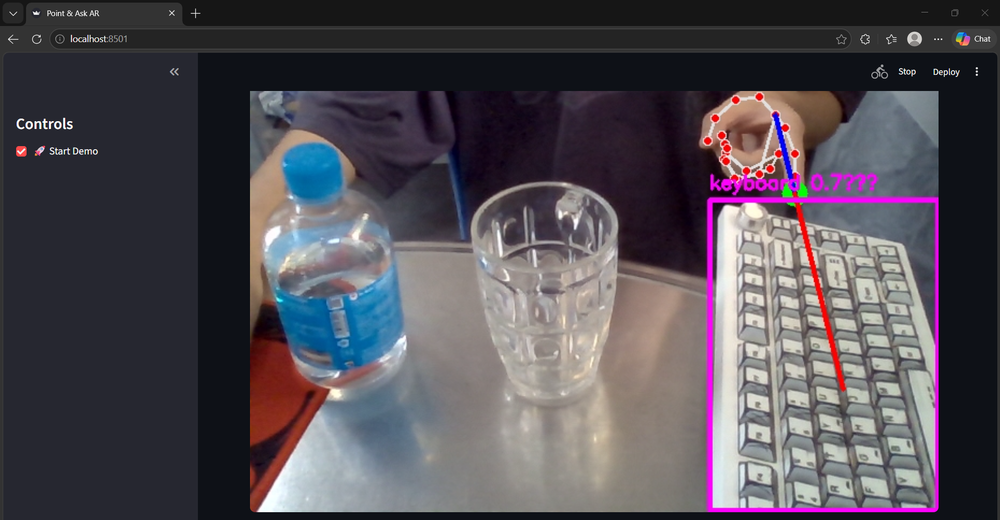
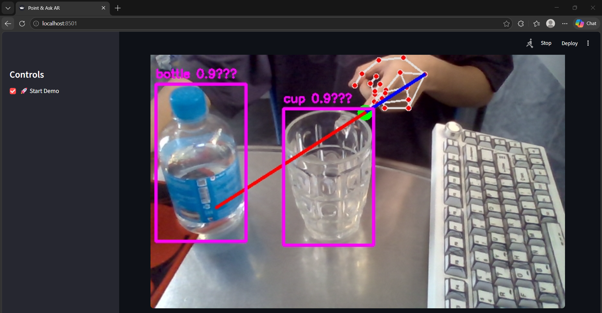

# Point & Detection : Object Detection System

Currently, many smart glasses use technologies such as cameras and large language models (LLMs) to provide useful information to users. 

In this project, I do not aim to build a complex system. Instead, the goal is to explore a simple approach to help a machine understand which object a person is pointing at. This project is mainly for learning and gaining a better understanding of how such systems work.


# Idea

The system first detects a hand and finds the positions of the wrist and the index finger. A line is then extended from the wrist through the finger to indicate the pointing direction. Next, objects in the frame are detected, and the system checks which object the line points to. The selected object is highlighted with a box, along with its name and confidence. 


# Technologies

Python (3.11.9): Programming language  
MediaPipe (0.10.5): Hand detection and tracking (21 landmark points)  
YOLOv8 (v8n): Object detection (nano model for fast inference)  
OpenCV (4.8.0+): Image processing and visualization (drawing bounding boxes and lines)  
Streamlit (1.28.0+): Web interface for real-time interaction  
NumPy (1.24.0+): Numerical computation for vectors and arrays  


# Installation

1. Create virtual environment (Python 3.11)
py -3.11 -m venv venv

2. Activate
.\venv\Scripts\Activate

3. Install dependencies
pip install -r requirements.txt

4. Run
streamlit run main/point_detection_v2.py

# Project Structure

```
PointAndDetection/
├── main/
│   └── point_detection_v2.py     # Main application
├── CODE_EXPLANATION.md           # Detailed code documentation
├── README.md                     # This file
├── requirements.txt              # Python dependencies
├── .gitignore                    # Git exclusion rules
└── venv/                         # Virtual environment
```

# Result
Object Detection






Since the video is in 2D while the real world is 3D, the projected line may point to the wrong object or intersect with multiple objects along its path.




